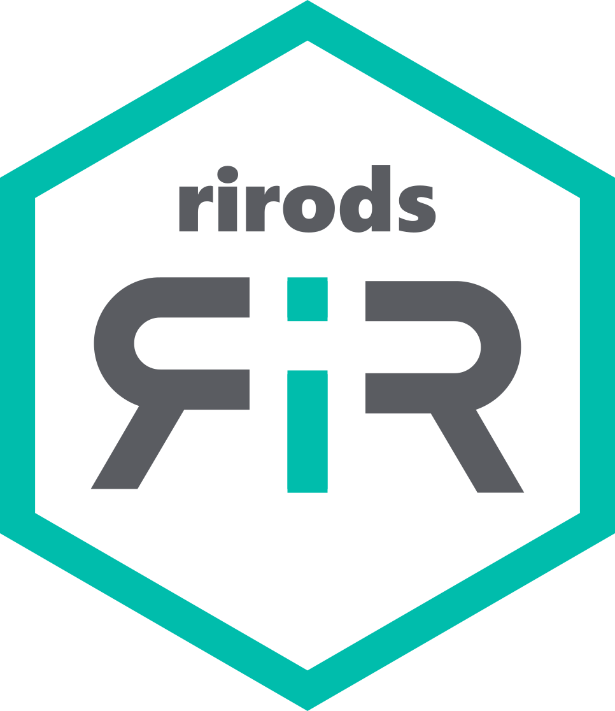

<!-- README.md is generated from README.Rmd. Please edit that file -->

# rirods 

<!-- badges: start -->

<!-- badges: end -->

The rirods package is an R client for iRODS.

## Installation

You can install the latest CRAN version of rirods like so:

    install.packages("rirods")

Or, the development version from GitHub, like so:

    # install.packages("devtools")
    devtools::install_github("irods/irods_client_library_rirods")

## Prerequisites

This package connects to the iRODS C++ HTTP API -
<https://github.com/irods/irods_client_http_api>.

Launch a local demonstration iRODS service (including the HTTP API):

    # load
    library(rirods)
    # setup a mock iRODS server (https://github.com/irods/irods_demo)
    use_irods_demo("alice", "passWORD")

This will result in the demonstration HTTP API running at
“<http://localhost:9001/irods-http-api/0.2.0>”.

These Docker containers are designed to easily stand up a
**DEMONSTRATION** of the iRODS server. It is intended for education and
exploration. (See also `vignette("demo")`.)

**DO NOT USE IN PRODUCTION**

## Example Usage

To connect to the HTTP API endpoint of your choice, load `rirods`,
connect with `create_irods()`, and authenticate with your iRODS
credentials:

    create_irods("http://localhost:9001/irods-http-api/0.2.0")

### Authentication

In this example Alice is a user of iRODS and she can authenticate
herself with `iauth("alice")`. This prompts a dialog where you can enter
your password without hardcoding this information in your scripts.

    # login as alice with password "passWORD"
    iauth("alice") # or iauth("alice", "passWORD")

### Save R objects

Suppose Alice would like to upload an R object from her current R
session to an iRODS collection. For this, use the `isaveRDS()` command:

    # some data
    foo <- data.frame(x = c(1, 8, 9), y = c("x", "y", "z"))

    # check where we are in the iRODS namespace
    ipwd()
    #> [1] "/tempZone/home/alice"

    # store data in iRODS
    isaveRDS(foo, "foo.rds")

### Metadata

To truly appreciate the strength of iRODS, we can add some metadata that
describes the data object “foo”:

    # add some metadata
    imeta(
      "foo.rds", 
      operations = 
        data.frame(operation = "add", attribute = "foo", value = "bar", units = "baz")
    )

    # check if file is stored with associated metadata
    ils(metadata = TRUE)
    #> 
    #> ==========
    #> iRODS Zone
    #> ==========
    #>                  logical_path attribute value units
    #>  /tempZone/home/alice/foo.rds       foo   bar   baz

For more on using metadata, check out `vignette("metadata")`.

### Read R objects

If Alice wanted to copy the foo R object from an iRODS collection to her
current R session, she would use `ireadRDS()`:

    # retrieve in native R format
    ireadRDS("foo.rds")
    #>   x y
    #> 1 1 x
    #> 2 8 y
    #> 3 9 z

### Other file formats

Possibly Alice does not want a native R object to be stored on iRODS but
a file type that can be accessed by other programs. For this, use the
`iput()` command:

    library(readr)

    # creates a csv file of foo
    write_csv(foo, "foo.csv")

    # send file
    iput("foo.csv", "foo.csv")

    # check whether it is stored
    ils()
    #> 
    #> ==========
    #> iRODS Zone
    #> ==========
    #>                  logical_path
    #>  /tempZone/home/alice/foo.csv
    #>  /tempZone/home/alice/foo.rds

Later on somebody else might want to download this file again and store
it locally:

    # retrieve it again later
    iget("foo.csv", "foo.csv")
    read_csv("foo.csv")
    #> Rows: 3 Columns: 2
    #> ── Column specification ────────────────────────────────────────────────────────
    #> Delimiter: ","
    #> chr (1): y
    #> dbl (1): x
    #> 
    #> ℹ Use `spec()` to retrieve the full column specification for this data.
    #> ℹ Specify the column types or set `show_col_types = FALSE` to quiet this message.
    #> # A tibble: 3 × 2
    #>       x y    
    #>   <dbl> <chr>
    #> 1     1 x    
    #> 2     8 y    
    #> 3     9 z

### Query

By adding metadata you and others can more easily discover data in
future projects. Objects can be searched with General Queries and
`iquery()`:

    # look for objects in the home collection with a wildcard `%`
    iquery("SELECT COLL_NAME, DATA_NAME WHERE COLL_NAME LIKE '/tempZone/home/%'")
    #>              COLL_NAME DATA_NAME
    #> 1 /tempZone/home/alice   foo.csv
    #> 2 /tempZone/home/alice   foo.rds

    # or for data objects with a name that starts with "foo"
    iquery("SELECT COLL_NAME, DATA_NAME WHERE DATA_NAME LIKE 'foo%'")
    #>              COLL_NAME DATA_NAME
    #> 1 /tempZone/home/alice   foo.csv
    #> 2 /tempZone/home/alice   foo.rds

For more on querying, check out `vignette("metadata")`.

### Cleanup

Finally, we can clean up Alice’s home collection:

    # delete object
    irm("foo.rds", force = TRUE)
    irm("foo.csv", force = TRUE)

    # check if objects are removed
    ils()
    #> This collection does not contain any objects or collections.

    # close the server
    stop_irods_demo()
    # optionally remove the Docker images
    # irods:::remove_docker_images()
